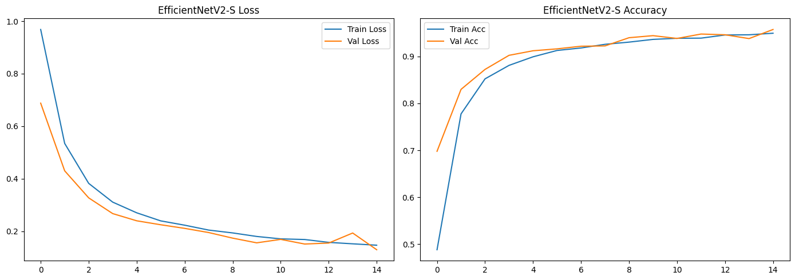
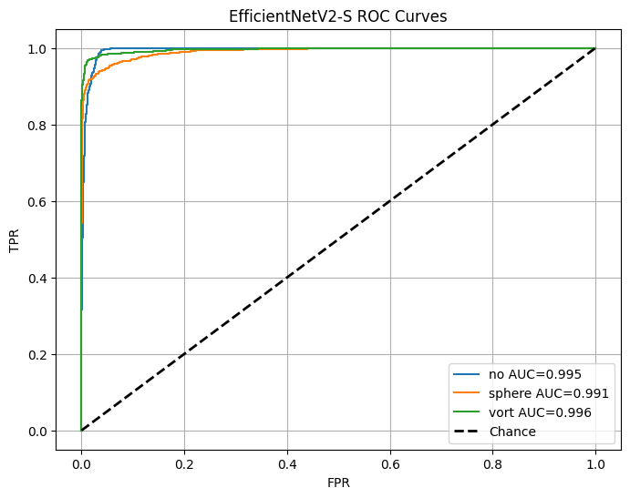
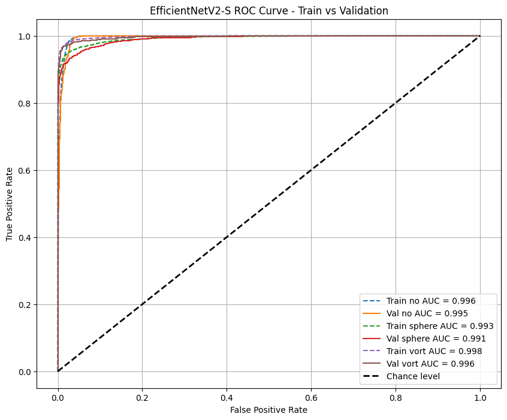
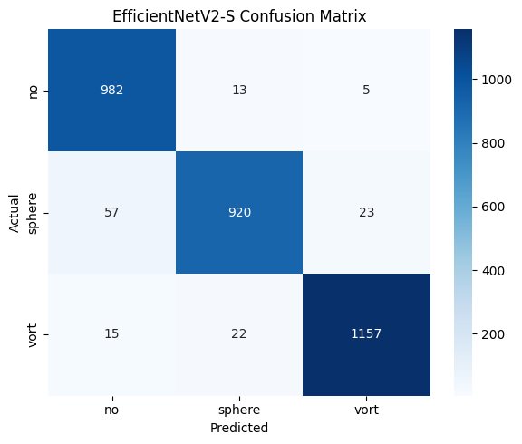
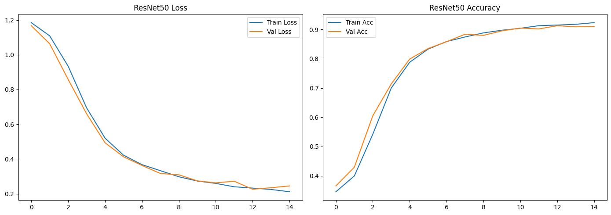
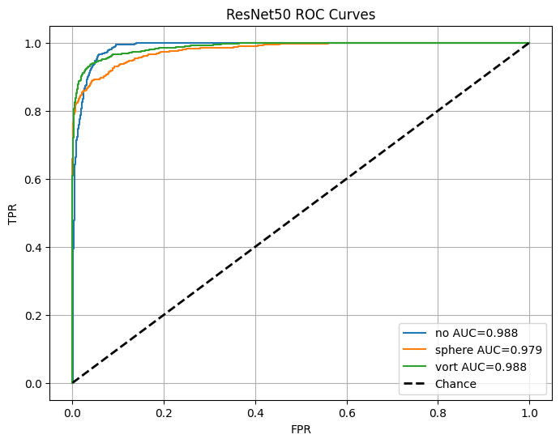
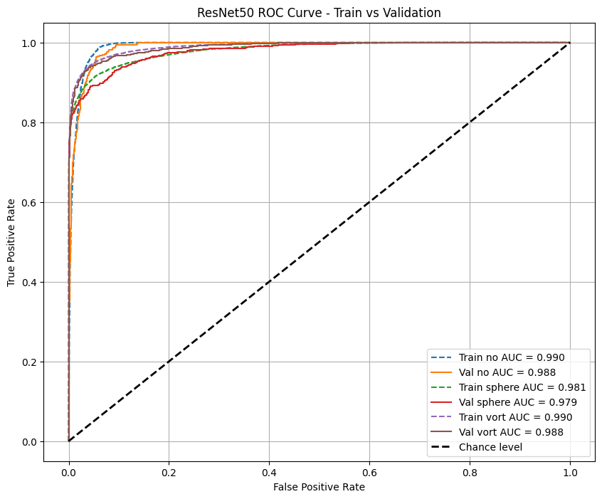
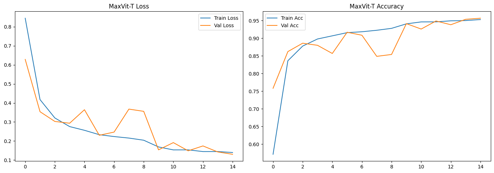
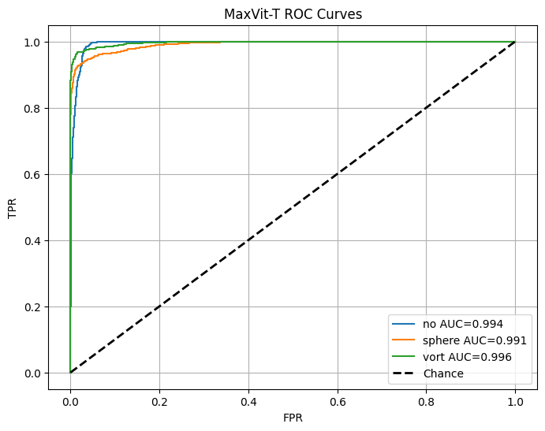
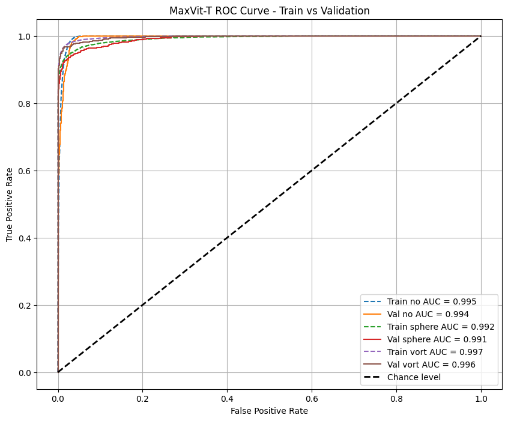

# DeepLense Task 1: Multi-Class Lensing Classification

This folder contains my solution for **Task 1** of the DeepLense test: classifying normalized lensing images into three categories using **PyTorch transfer learning**.

The task is a **three-class image classification problem** with the following labels:

- `no`: strong lensing image with no substructure
- `sphere`: lensing image with smooth subhalo-like structure
- `vort`: lensing image with vortex-like substructure

The main evaluation target is **ROC-AUC**, so the project is built not only to maximize accuracy, but also to produce reliable class probabilities and class-wise ROC curves.

## Abstract

I approached this task as a **transfer learning problem for scientific image classification**, using pretrained computer vision backbones and adapting them to grayscale lensing maps stored as `.npy` arrays. The final pipeline combines `log1p` intensity scaling, physically reasonable geometric augmentation, a fresh 90:10 stratified split, and model comparison across three pretrained architectures: `EfficientNetV2-S`, `ResNet50`, and `MaxVit-T`.

The strongest results came from **EfficientNetV2-S** and **MaxVit-T**, which both achieved a **macro AUC of about 0.994** on the validation set. `EfficientNetV2-S` remained the best overall model, reaching **95.77%** validation accuracy with the lowest validation loss. `MaxVit-T` remained extremely competitive, peaking at **95.68%** validation accuracy during training and achieving a checkpoint-evaluated validation accuracy of **95.37%** with macro AUC **0.9940**. `ResNet50` served as a useful baseline, but continued to lag behind the stronger models, especially on the `sphere` class. Overall, the rerun supports the same conclusion: modern transfer learning backbones are highly effective at distinguishing not only lens from non-lens examples, but also smooth versus perturbed substructure in lensing images.

## Project Goal

The objective is to train a model that can distinguish between:

1. images with no substructure
2. images with smooth substructure
3. images with vortex-like perturbations

Because these are subtle astrophysical differences rather than ordinary natural-image categories, the pipeline emphasizes:

- preserving faint lensing structure
- using augmentations that respect the physics of the problem
- comparing multiple pretrained backbones rather than relying on a single model

## Repository Contents

```text
Task-1/
|-- README.md
|-- Task_1.ipynb
|-- dataset/
|-- dataset_fast_224/
|-- best_efficientnet_v2_s_lensing.pt
|-- best_resnet50_lensing.pt
|-- best_maxvit_t_lensing.pt
|-- EfficientNetV2_ConfusionMatrix.png
|-- EfficientNetV2_LossCurve.png
|-- EfficientNetV2_ROCCurves.png
|-- EfficientNetV2_ROCCurves_TrainVal.png
|-- ResNet50_ConfusionMatrix.png
|-- ResNet50_LossCurve.png
|-- ResNet50_ROCCurves.png
|-- ResNet50_ROCCurves_TrainVal.png
|-- MaxVit-T_ConfusionMatrix.png
|-- MaxVit-T_LossCurve.png
|-- MaxVit-T_ROCCurves.png
`-- MaxVit-T_ROCCurves_TrainVal.png
```

## Approach and Process

Instead of building a CNN from scratch, I used **transfer learning** with ImageNet-pretrained vision models. This is the most practical approach for this task because:

- the dataset is large enough to fine-tune modern models
- the lensing structures are subtle and benefit from pretrained low-level and mid-level feature extractors
- the task requires strong probability estimates for ROC-AUC, not just hard labels

The workflow in the notebook is intentionally simple and reproducible:

1. inspect the dataset and sample tensor shapes
2. collect image paths and labels into a dataframe
3. build a fresh **90:10 stratified split**
4. preprocess each `.npy` image into a model-friendly tensor
5. apply augmentation only to the training set
6. train several pretrained backbones under the same pipeline
7. compare models with loss curves, confusion matrices, ROC curves, classification reports, and macro AUC

## Data Pipeline

### Input Format

The raw dataset is stored as `.npy` arrays rather than standard image files. Each sample is loaded directly with NumPy and then converted into a PyTorch tensor.

### Preprocessing

The core preprocessing step is designed for lensing maps rather than natural photos:

- load the normalized `.npy` array
- apply `log1p` scaling to compress dynamic range
- resize to `224 x 224`
- repeat the single channel to `3` channels so standard ImageNet models can be used directly
- normalize using a simple `mean=0.5`, `std=0.5` style transform

The `log1p` step is important because lensing arcs and perturbations can be faint relative to background regions. Compressing the dynamic range helps the model attend to subtle structures without losing the global geometry.

### Augmentation

Training augmentation focuses on transformations that are physically reasonable for lensing data:

- random rotation
- random zoom in and out
- flips

These choices are useful because the existence of a lens or perturbation should not depend on a fixed image orientation.

## Fast Dataset Optimization

Because the dataset is stored as `.npy` arrays and resizing tensors on the fly is slow, the notebook also supports a preprocessed cache:

- raw `.npy` files are converted once into preprocessed `.pt` tensors
- the cached tensors are stored under `dataset_fast_224/`
- later runs automatically use the fast dataset when it is available

This is especially useful on **Windows + Jupyter**, where multiprocessing with dataloader workers is less stable and CPU-side preprocessing can become the bottleneck.

## Models Compared

I trained and compared three pretrained backbones:

- `EfficientNetV2-S`
- `ResNet50`
- `MaxVit-T`

These were chosen to give a meaningful range of model families:

- **ResNet50**: classic CNN baseline
- **EfficientNetV2-S**: efficient modern convolutional backbone
- **MaxVit-T**: hybrid architecture with stronger global modeling

## Training Setup

All models use the same general training strategy:

- framework: **PyTorch**
- optimizer: **Adam**
- scheduler: **ReduceLROnPlateau**
- loss: **CrossEntropyLoss**
- epochs: **15**
- evaluation: **validation accuracy, confusion matrix, per-class ROC, macro AUC**

The exact batch size varies by model so each backbone fits comfortably in memory:

- EfficientNetV2-S: `128`
- ResNet50: `128`
- MaxVit-T: `64`

## Why This Design Makes Sense for the Task

This task is not just "image classification" in the generic sense. The models need to separate:

- absence of substructure
- smooth mass structure
- perturbed or vortex-like structure

That means the pipeline has to preserve both:

- local texture and small perturbation signals
- global ring or arc geometry

Using multiple pretrained backbones helps test which representation works best:

- CNN-heavy models are excellent at local edges and texture
- attention-based or hybrid models often help with larger spatial relationships

## Results Overview

The strongest models were `EfficientNetV2-S` and `MaxVit-T`.

| Model | Peak Validation Accuracy | Checkpoint Validation Accuracy | Macro AUC | Validation Loss |
| :--- | :---: | :---: | :---: | :---: |
| EfficientNetV2-S | **95.77%** | **95.77%** | **0.9940** | **0.1295** |
| MaxVit-T | 95.68% | 95.37% | **0.9940** | 0.1426 |
| ResNet50 | 91.30% | 91.08% | 0.9854 | 0.2448 |

### Results Summary

These results are unusually strong for a three-class lensing classification task. In particular:

- **EfficientNetV2-S** achieved the best overall validation accuracy and the lowest validation loss.
- **MaxVit-T** matched EfficientNetV2-S on macro AUC and remained very balanced class-wise, although its checkpoint-evaluated accuracy was slightly below its peak training-epoch accuracy.
- **ResNet50** remained a useful baseline, but it lagged behind the stronger models, especially on `sphere`.
- All three models performed best on `vort`, suggesting that the pipeline is highly sensitive to perturbation-rich lensing structure.

### Key Findings

- `EfficientNetV2-S` was the best overall model by both peak and checkpoint validation accuracy.
- `MaxVit-T` was effectively tied on macro AUC and showed very balanced performance, even though its checkpoint-evaluated accuracy landed slightly below its peak epoch accuracy.
- `ResNet50` worked well as a baseline but clearly underperformed relative to the stronger models.
- All models performed especially well on the `vort` class, which suggests the pipeline is sensitive to perturbation-rich lensing structure.

## Scientific Interpretation

These results support a few reasonable claims:

### 1. Limited Overfitting

The strongest models show close train-validation alignment, which suggests the models are learning transferable lensing features rather than memorizing the training split.

### 2. Sensitivity to Substructure

The very high AUC values for `vort` indicate that transfer learning is effective for distinguishing smooth and perturbed mass distributions.

### 3. Preprocessing Matters

The strong results likely depend in part on the preprocessing pipeline, especially:

- `log1p` scaling
- rotation and zoom augmentation
- clean resizing and normalization

These steps appear to make faint arcs and perturbations easier for the networks to exploit.

## Results and Figures

The notebook saves training curves, ROC curves, train-vs-validation ROC plots, and confusion matrices for each model. The plots below are included directly in the repository so the README captures both the process and the final evidence.

### EfficientNetV2-S

EfficientNetV2-S was the strongest overall model in the rerun:

- Peak validation accuracy: **95.77%**
- Checkpoint validation accuracy: **95.77%**
- Macro AUC: **0.9940**
- Validation loss: **0.1295**

| Loss / Accuracy | Validation ROC |
| :---: | :---: |
|  |  |

| Train vs Validation ROC | Confusion Matrix |
| :---: | :---: |
|  |  |

### ResNet50

ResNet50 was useful as a baseline comparison:

- Peak validation accuracy: **91.30%**
- Checkpoint validation accuracy: **91.08%**
- Macro AUC: **0.9854**
- Validation loss: **0.2448**

| Loss / Accuracy | Validation ROC |
| :---: | :---: |
|  |  |

| Train vs Validation ROC | Confusion Matrix |
| :---: | :---: |
|  |  |

### MaxVit-T

MaxVit-T was nearly tied with EfficientNetV2-S and showed especially balanced performance:

- Peak validation accuracy: **95.68%**
- Checkpoint validation accuracy: **95.37%**
- Macro AUC: **0.9940**
- Validation loss: **0.1426**

| Loss / Accuracy | Validation ROC |
| :---: | :---: |
|  |  |

| Train vs Validation ROC | Confusion Matrix |
| :---: | :---: |
|  |  |

## Notebook Outputs

The notebook produces, for each model:

- training and validation loss curves
- training and validation accuracy curves
- confusion matrix
- validation ROC curves
- train-vs-validation ROC curves
- validation classification report
- per-class AUC
- overall macro AUC

This makes it easy to compare not only final accuracy, but also class balance, calibration quality, and convergence behavior.

## How to Run

Open `Task_1.ipynb` and run the cells from top to bottom.

Typical workflow:

1. ensure the raw dataset is available under `Task-1/dataset/`
2. run the setup and data inspection cells
3. allow the notebook to build `dataset_fast_224/` if it is missing
4. train the three backbones
5. review the saved plots and checkpoint files

## Notes for Windows / Jupyter

This notebook was adapted to be more Windows-safe:

- it avoids fragile worker-heavy dataloading patterns
- it supports preprocessed cached tensors for much faster reuse
- the final execution logic is grouped in a notebook-friendly way

If training ever feels slow on a local machine, the biggest speed improvement usually comes from:

- using the `dataset_fast_224/` cache
- keeping batch sizes high enough for the GPU
- reducing expensive on-the-fly preprocessing

## Final Recommendation

If I had to choose a single model from this project, I would select **EfficientNetV2-S** as the final submission model because it achieved:

- the best validation accuracy
- the best final validation loss
- a macro AUC tied for best overall

`MaxVit-T` is an excellent second choice and is nearly identical in overall quality.
