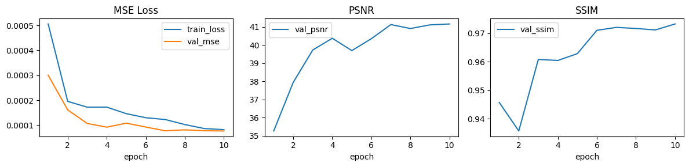
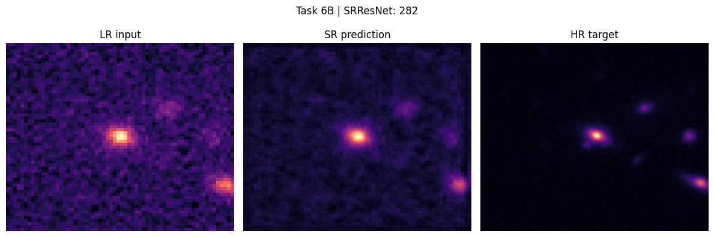
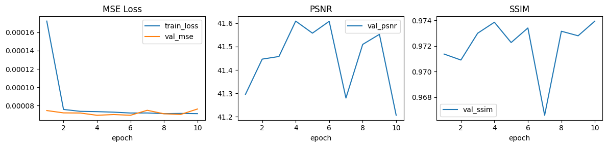
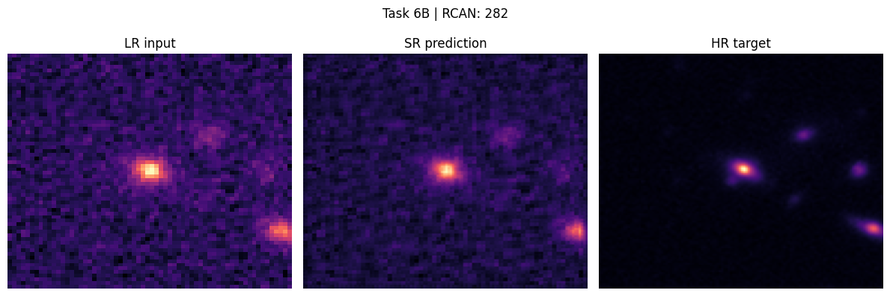
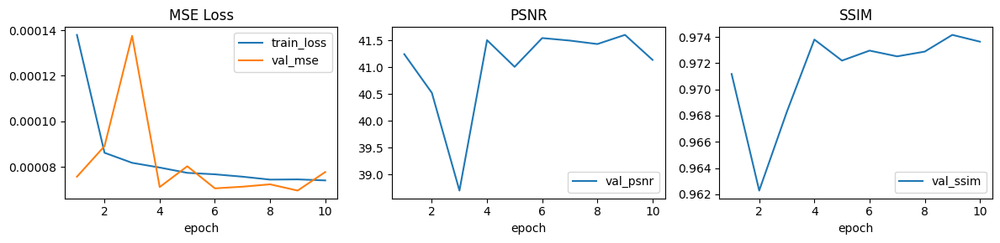
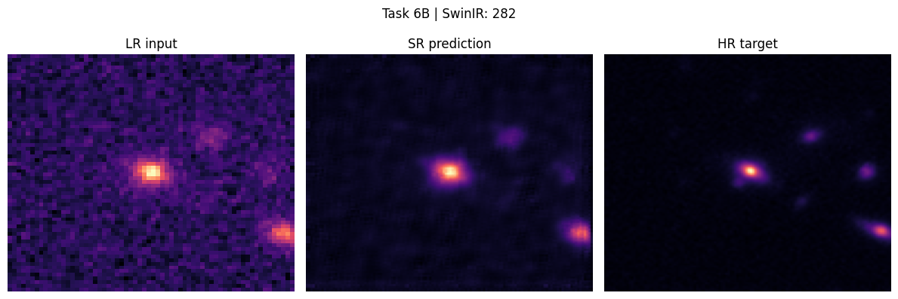

# DeepLense Task 6: Multi-Model Strong-Lensing Super-Resolution

This folder contains my solution for **Task 6** of the DeepLense test: reconstructing **high-resolution lensing images from low-resolution inputs** using **PyTorch super-resolution models**.

The task is divided into two connected parts:

- **Task VI.A**: supervised super-resolution on simulated `LR` / `HR` lensing pairs
- **Task VI.B**: domain-adaptation fine-tuning on real `HSC` / `HST` telescope pairs

The main evaluation targets are **MSE, PSNR, and SSIM**, so the project is built not only to minimize reconstruction error, but also to preserve perceptual and structural fidelity in strong-lensing morphology.

## Abstract

I approached this task as a **scientific image super-resolution and transfer learning problem** rather than a generic image enhancement benchmark. The final pipeline combines explicit LR-HR pair indexing, intensity normalization, train-time geometric augmentation, RAM-side dataset caching, mixed-precision training, model comparison across three architectures, and a second-stage transfer setup where the best weights from Task VI.A are fine-tuned on Task VI.B.

Three model families were compared:

- `SRResNet`: residual CNN baseline
- `RCAN`: channel-attention CNN
- `SwinIR`: lightweight transformer-based super-resolution model

On **Task VI.A**, the strongest models were **RCAN** and **SwinIR**, which finished essentially tied at the top with validation PSNR around **41.6 dB** and SSIM around **0.974**. `RCAN` achieved the best validation MSE, while `SwinIR` achieved the best SSIM. On **Task VI.B**, all models experienced a meaningful drop under simulation-to-real domain shift, but **SwinIR** generalized best after fine-tuning, achieving the top PSNR and SSIM on the real telescope pairs.

## Project Goal

The objective is to learn mappings from low-resolution lensing observations to high-resolution reconstructions while preserving:

1. global Einstein ring and arc morphology
2. fine local structure and subtle perturbations
3. robustness when transferring from simulated data to real observations

Because this is an astrophysical reconstruction task rather than an ordinary vision benchmark, the pipeline emphasizes:

- correct LR-HR pairing and scale handling
- evaluation with scientific image-quality metrics
- model comparison across CNN and transformer families
- transfer learning from synthetic supervision to real telescope data

## Repository Contents

```text
Task-6/
|-- README.md
|-- Task_6.ipynb
|-- dataset_a/
|-- dataset_b/
|-- network_swinir.py
|-- task6a_srresnet_best.pt
|-- task6a_rcan_best.pt
|-- task6a_swinir_best.pt
|-- task6b_srresnet_best.pt
|-- task6b_rcan_best.pt
|-- task6b_swinir_best.pt
|-- SRResNet_LossCurve.png
|-- RCAN_LossCurve.png
|-- SwinIR_LossCurve.png
|-- SRResNet_TaskB.png
|-- RCAN_TaskB.png
`-- SwinIR_TaskB.png
```

## Approach and Process

Instead of relying on a single architecture, I set the notebook up as a **controlled ablation study**. This is useful for Task 6 because super-resolution quality depends strongly on the inductive bias of the model:

- residual CNNs are strong and efficient local baselines
- attention-based CNNs may separate signal from noise more effectively
- transformer-based models can better preserve broader spatial structure

The workflow in the notebook is intentionally consistent and reproducible:

1. inspect the dataset and sample LR / HR tensor shapes
2. discover matching `LR` and `HR` files and build a paired dataframe
3. normalize each sample and cache tensors in RAM for faster epochs
4. apply augmentation only to the training split
5. train `SRResNet`, `RCAN`, and `SwinIR` under the same pipeline
6. compare models with `MSE`, `PSNR`, `SSIM`, loss curves, and reconstruction panels
7. fine-tune the best Task VI.A weights on Task VI.B with a reduced learning rate

## Data Pipeline

### Input Format

The datasets are stored as paired `LR` and `HR` arrays, primarily in `.npy` format. The notebook automatically discovers the correct split directories and matches the pairs by normalized sample identifiers, including cases like:

- `sample123.npy` vs `sample123.npy`
- `LR_123.npy` vs `HR_123.npy`

This makes the pipeline more robust across Dataset A and Dataset B naming conventions.

### Preprocessing

The core preprocessing routine is designed for grayscale lensing maps:

- load the raw `.npy` array
- normalize intensities to `[0, 1]`
- sanitize `NaN` and infinite values
- ensure channel-first tensor shape

Unlike Task 1, this notebook does **not** resize everything to a fixed classification resolution, because the LR-to-HR scale factor itself is part of the problem.

### Augmentation

Training augmentation is deliberately simple and physically reasonable:

- random horizontal flips
- random vertical flips
- random 90-degree rotations

These choices are appropriate because strong-lensing morphology should remain meaningful under orientation changes.

## Performance and Engineering Optimizations

The notebook includes several practical optimizations so the experiments remain feasible on a local machine:

- **RAM caching** of preprocessed LR-HR pairs inside the dataset class
- **mixed precision** via `autocast` and `GradScaler`
- `bfloat16` autocast on CUDA for faster training and lower VRAM usage
- **fused AdamW** on CUDA when available
- reduced **SwinIR-Light** settings for a more realistic local ablation

This keeps the code notebook-friendly while still demonstrating a research-oriented training setup.

## Models Compared

I trained and compared three super-resolution models:

- `SRResNet`
- `RCAN`
- `SwinIR`

These were chosen to span a meaningful range of architectural ideas:

- **SRResNet**: classic residual CNN baseline
- **RCAN**: channel-attention CNN designed to emphasize informative features
- **SwinIR**: transformer-based model with stronger global context modeling

## Training Setup

All models use the same general training design:

- framework: **PyTorch**
- loss: **MSELoss**
- evaluation: **MSE, PSNR, SSIM**
- Task VI.A epochs: **10**
- Task VI.B epochs: **5**
- Task VI.B learning rate: **10x lower** than Task VI.A fine-tuning base

Per-model settings vary slightly to fit memory and training-speed constraints:

- `SRResNet`: batch size `8`
- `RCAN`: batch size `8`
- `SwinIR`: batch size `4`

## Why This Design Makes Sense for the Task

Task 6 is not just about producing sharper images visually. The reconstructed outputs need to preserve astrophysically meaningful structure. That means the models must recover both:

- local high-frequency detail
- large-scale ring and arc geometry

Using multiple architectures helps test which inductive bias is most effective:

- CNNs are strong at local texture reconstruction
- attention helps isolate useful features from noise
- transformer-based models may transfer better when global morphology matters

The two-stage setup also reflects a realistic scientific workflow: first learn from abundant simulations, then adapt carefully to scarce real data.

## Results Overview

### Task VI.A: Simulated Super-Resolution

| Model | Validation MSE | Validation PSNR | Validation SSIM |
| :--- | :---: | :---: | :---: |
| RCAN | **0.000069** | **41.61** | 0.9739 |
| SwinIR | 0.000070 | 41.60 | **0.9742** |
| SRResNet | 0.000077 | 41.16 | 0.9732 |

### Task VI.B: Real Telescope Fine-Tuning

| Model | Validation MSE | Validation PSNR | Validation SSIM |
| :--- | :---: | :---: | :---: |
| SwinIR | **0.000803** | **32.38** | **0.8353** |
| SRResNet | 0.000828 | 31.19 | 0.8118 |
| RCAN | 0.000913 | 30.73 | 0.7894 |

### Results Summary

These runs support a clear pattern:

- **Task VI.A** is well learned by all three models, with `RCAN` and `SwinIR` essentially tied at the top.
- **RCAN** is the best pure simulated-data model by validation MSE.
- **SwinIR** achieves the strongest structural fidelity by SSIM on Task VI.A and is the best transfer model on Task VI.B.
- **Task VI.B** is substantially harder, which highlights a real simulation-to-observation domain shift.

### Key Findings

- `RCAN` was the most sample-efficient and stable model on Task VI.A.
- `SwinIR` reached nearly identical Task VI.A quality and generalized best after real-data fine-tuning.
- `SRResNet` remained a strong baseline, but the more expressive models produced better final reconstructions.
- The drop from Task VI.A to Task VI.B is itself an important scientific finding: strong simulated performance does not automatically carry over to real telescope data without adaptation.

## Scientific Interpretation

These results support several reasonable claims:

### 1. Simulated Reconstruction is Solved More Easily Than Real Transfer

The very low Task VI.A MSE and high PSNR / SSIM suggest that all three models can learn the synthetic mapping effectively. The substantial Task VI.B drop shows that domain shift remains a major challenge.

### 2. Architectural Bias Matters

`RCAN` appears especially effective when the task is fully supervised on simulated data, likely because attention helps isolate informative structure. `SwinIR` appears more robust when generalization across domains becomes important.

### 3. Transfer Learning is Necessary for Part B

Fine-tuning from Task VI.A weights is much more sensible than training Task VI.B from scratch, given the much smaller real dataset.

### 4. The "Regression to the Mean" Limitation

While PSNR scores were high, visual inspection shows all models struggled to generate the high-frequency "noisy blur" inherent to real telescope Point Spread Functions (PSF). Because the networks were optimized purely on `MSELoss`, they heavily penalized incorrect high-frequency noise guesses. As a result, the models safely regressed to the mean, producing overly smooth pixel borders rather than physically accurate sensor-noise textures.

## Results and Figures

The notebook saves loss curves for each model and qualitative reconstruction examples for Task VI.B.

### SRResNet

- Task VI.A: `val_mse = 0.000077`, `val_psnr = 41.16`, `val_ssim = 0.9732`
- Task VI.B: `val_mse = 0.000828`, `val_psnr = 31.19`, `val_ssim = 0.8118`

| Loss Curve | Task VI.B Reconstruction |
| :---: | :---: |
|  |  |

### RCAN

- Task VI.A: `val_mse = 0.000069`, `val_psnr = 41.61`, `val_ssim = 0.9739`
- Task VI.B: `val_mse = 0.000913`, `val_psnr = 30.73`, `val_ssim = 0.7894`

| Loss Curve | Task VI.B Reconstruction |
| :---: | :---: |
|  |  |

### SwinIR

- Task VI.A: `val_mse = 0.000070`, `val_psnr = 41.60`, `val_ssim = 0.9742`
- Task VI.B: `val_mse = 0.000803`, `val_psnr = 32.38`, `val_ssim = 0.8353`

| Loss Curve | Task VI.B Reconstruction |
| :---: | :---: |
|  |  |

## Notebook Outputs

The notebook produces, for each model:

- epoch-by-epoch train MSE and validation MSE
- validation `PSNR`
- validation `SSIM`
- Task VI.A comparison table
- Task VI.B comparison table
- reconstruction panels showing `LR input`, `SR prediction`, and `HR target`
- saved best-weight checkpoints for both Task VI.A and Task VI.B

This makes it easy to compare convergence, reconstruction fidelity, and transfer behavior under domain shift.

## How to Run

Open `Task_6.ipynb` and run the cells from top to bottom.

Typical workflow:

1. ensure the paired data is available under `Task-6/dataset_a/` and `Task-6/dataset_b/`
2. run the setup and dataset inspection cells
3. train the three models on Task VI.A
4. allow the notebook to fine-tune on Task VI.B
5. review the saved checkpoints, plots, and reconstruction examples

## Notes for Windows / Jupyter

This notebook was adapted to be more Windows-safe and notebook-friendly:

- `num_workers` is kept at `0`
- the dataset is cached in RAM rather than relying on aggressive worker-based loading
- the full experiment is deferred to the final execution block

If training feels slow on a local machine, the biggest speed improvements usually come from:

- mixed precision on CUDA
- keeping SwinIR in its light configuration
- reducing epochs for exploratory runs

## Final Recommendation

If I had to choose a single final model from this project:

- for **Task VI.A only**, I would choose **RCAN** because it achieved the best validation MSE while matching the top tier of PSNR / SSIM
- for the **full Task VI.A -> VI.B transfer setting**, I would choose **SwinIR** because it generalized best to the real telescope pairs

That split recommendation reflects the main lesson of the notebook: the best simulation model is not always the best domain-transfer model.
